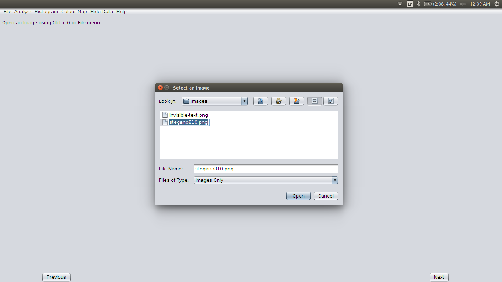
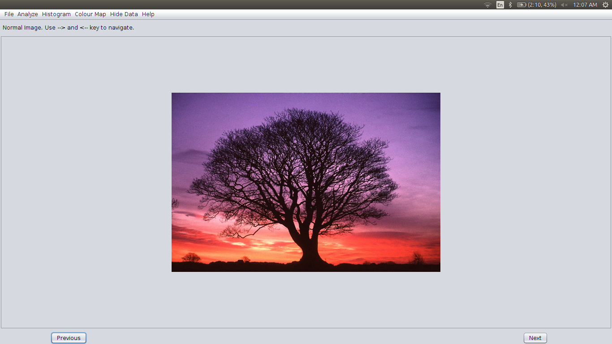
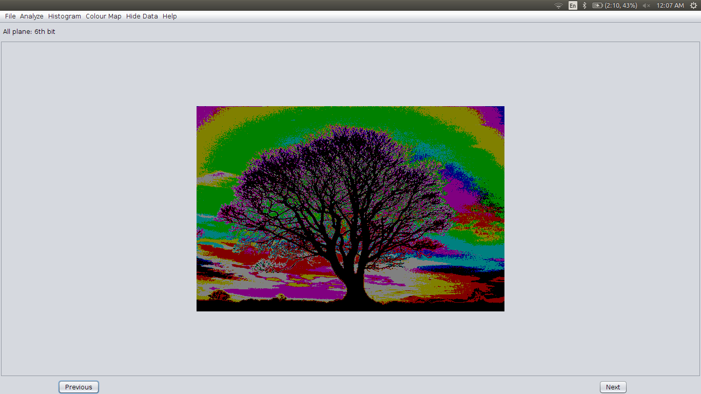
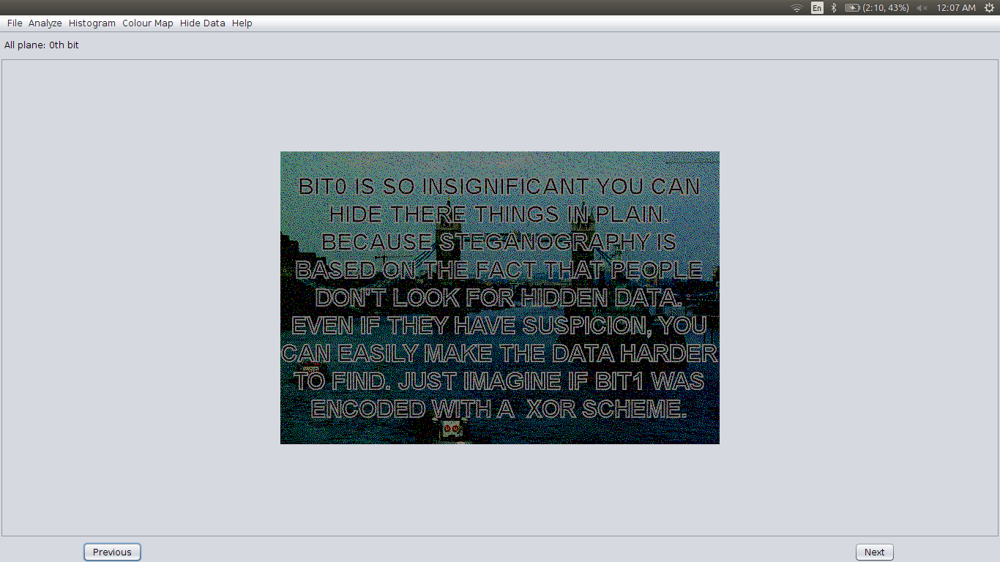
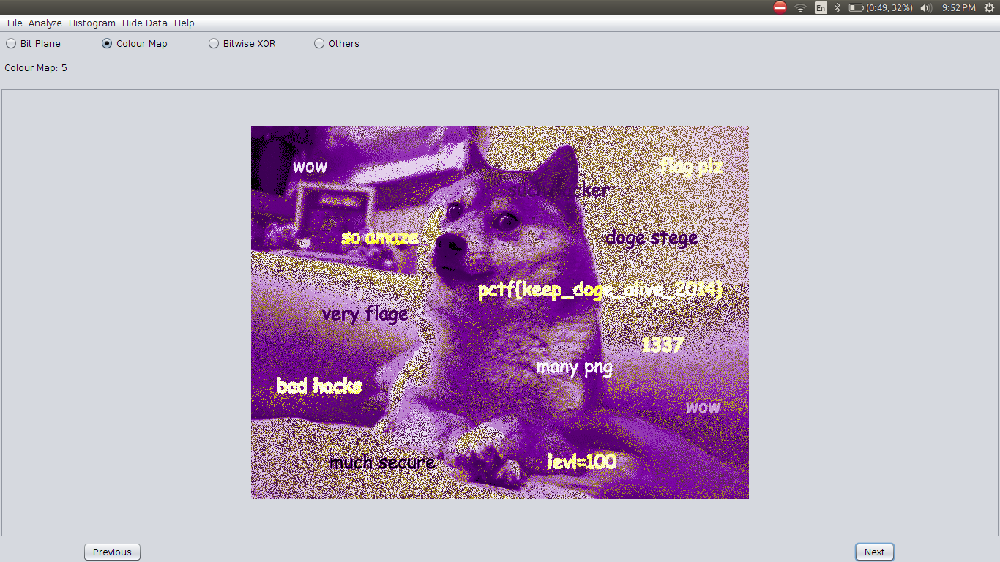
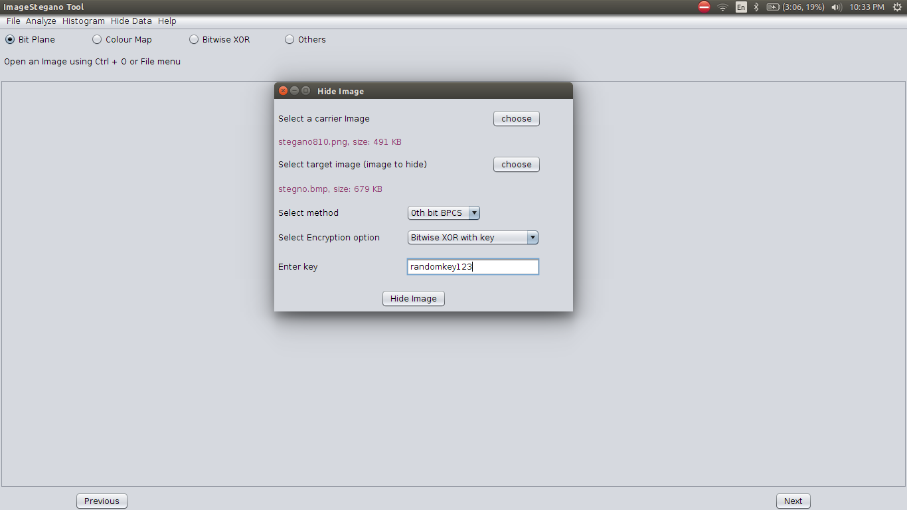
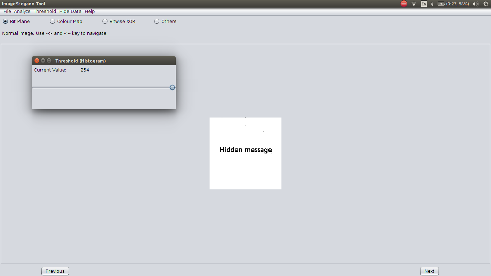
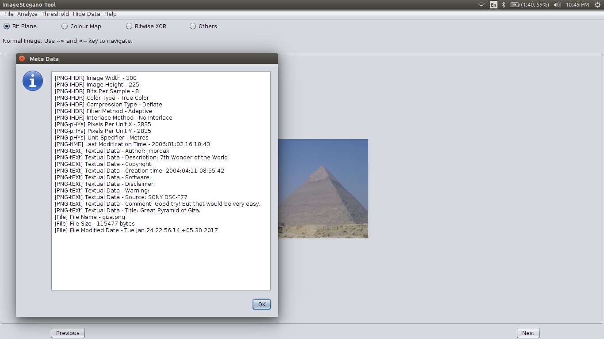
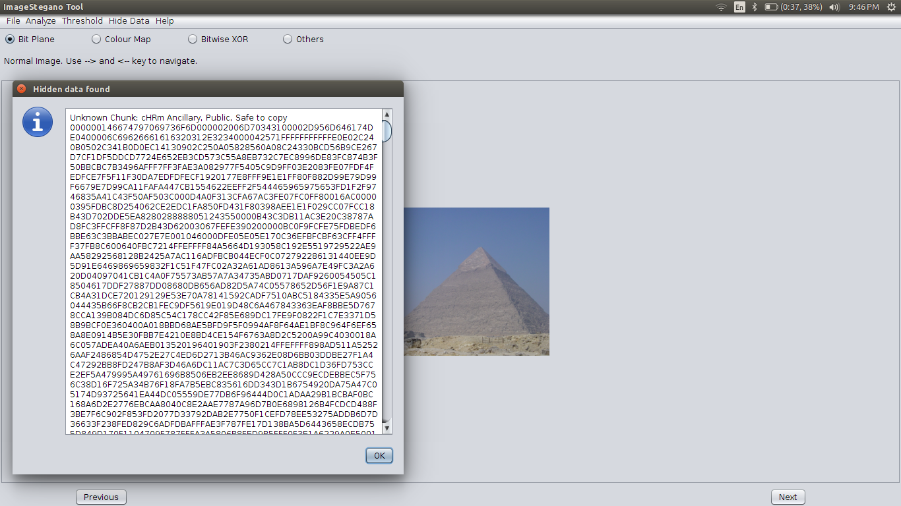

# Image-Stegano 
Steganography is the craft of concealing the way that correspondence is occurring, by concealing data in other data. A wide range of transporter document arrangements can be utilized, however advanced pictures are the most prevalent on account of their recurrence on the Internet. For concealing mystery data in pictures, there exists a vast assortment of steganographic methods some are more unpredictable than others and every one of them have separate solid and feeble focuses. Diverse applications have distinctive necessities of the steganography method utilized. For instance, a few applications may require outright intangibility of the mystery data, while others require a bigger mystery message to be covered up.

In the following project we are concentrating on least significant bit of the image and modifying it in spatial domain. We have broken down and concluded about the variations of this algorithm as far as efficiency and hiding capacity of an image. Viability of the algorithm is estimated by client assessments deciding so, all things considered change to the pictures wound up evident.

#### Application of Image Steganography

Steganography is employed in various useful applications, e.g. secret communication among agencies /
people, copyright control of materials, enhancing robustness of image search engines and smart IDs
(identity cards) where individuals’ details are embedded in their photographs. Other applications are
video-audio synchronization, companies’ safe circulation of secret data, TV broadcasting, TCP/IP packets
(for instance a unique ID can be embedded into an image to analyze the network traffic of particular
users). In steganography many different carrier file formats can be used, but digital images are the most
popular because of their frequency on the Internet.

#### Scope of the Tool:

Image-Stegano implements following steganographic methods-

1. 1 bit, 2 bits, 3 bits and 4 bits LSB (hiding as well as extraction)
2. 24 bits plane (Red, Green, Blue) and 32 bits plane (Red, Green, Blue, Alpha) analysis of image 
3. Bitwise XOR Implementation between LSB and payload
4. Steganography Based on File Format

This tool also provides following additional options-

1. Analysis of image using inversion and different colour maps
2. Grayscale analysis of image
3. Altering threshold of image (Histogram)
4. Providing metadata about the image
5. Chunks analysis of .png images
6. Extraction of appended Data (.PNG and .BMP files)

#### Working Demo of Bit Plane Steganography and Colour Map

1. Choose an image to open: 
2. Original Image: 
3. 6th bit plane (RGB) 
4. Hidden image in 0th bit plane 
5. Hidden Flag visible when color model is changed 

#### GUI Screenshots

1. Hide Image: 
2. Altering Threshold: 
3. Extracting Metadata: 
4. Hidden Data in PNG chunk: 

